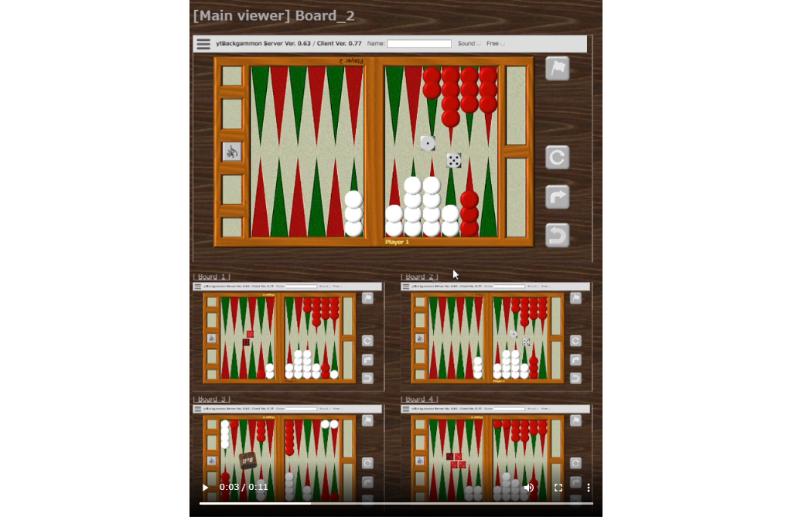
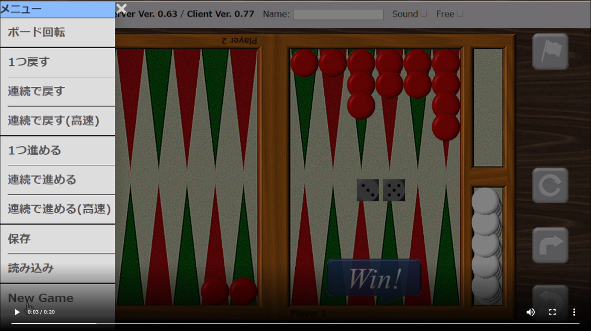

[](https://www.ytani.net/ytbackgammon/movies/ytBackgammon-demo-4boards.mp4)

# ytBackgammon -- ネットワーク共有型バックギャモンボード (Network Shared Backgammon Board)

http://www.ytani.net:8080/ytbackgammon/

## 特徴

通常の、ネット対戦やアプリとは違い...

カフェなどで、バックギャモンの会をやるような雰囲気を
ネット上で再現することを目指してます。

既存の対戦サイトやアプリでも、
3D表示できたり、
観戦したり、
チャットしたり
できますが、
どうしても密室でこもってやってる感じがしてしまい、
みんなで楽しくプレーする雰囲気がなかなか得られません。
(個人的な感想)

そこで、
近くで
「他の人がプレーしているのを感じられるようにできないか」
考えました。

同時にビデオチャット/音声チャットでつないで、
おしゃべりしながらお楽しみ下さい。

* 複数のボードで、複数の対戦を同時進行できます。
* 全てのボードを同時に見渡ることができますし、操作もできます。
* 操作性に関しては、厳密なルールチェックや効率より、
実際のボードの使い勝手の再現を重視しているつもりです。
* ボードを回転させて、どちらのプレーヤーの目線でも見ることができます。
* ルールを無視して、自由に動かせるモードがあります。(教育・検討用)
* いくらでも「戻して」、「やり直し」ができます。
* ボードのデザインを変えることができます。


## 動作環境

* スマホ、PCの Chromeブラウザ
(なるべく最新版をお使い下さい)

* ネットワークはなるべく高速で安定した回線をお使い下さい。
(ビデオ会議がストレスなくできるぐらい)

### 注意事項

* 以下のような要因で、タイムラグが生じることがあります。
  - 回線品質
  - PC、スマホの性能
  - Chromeのバージョン
  
* 表示が崩れたときは、ブラウザの再読込(リロード)をしてみて下さい。


## Usage

### 1. New game

[](https://www.ytani.net/ytbackgammon/movies/ytBackgammon-opening.mp4)


### 2. Doubling

#### 2.1 Double --> Take

[](https://www.ytani.net/ytbackgammon/movies/ytBackgammon-double-accept.mp4)


#### 2.2 Double --> Resign

[](https://www.ytani.net/ytbackgammon/movies/ytBackgammon-double-resign.mp4)


## 3. Score

スコアの計算は自動的に行われますが、
リセットしたり、修正したい場合は、手動で行うことができます。


## Board Design

オリジナルのデザインを作ることができます。
以下のファイルをダウンロードして、参考にして下さい。

* [デザイン テンプレート ファイル(ZIP形式)](docs/images0.zip)


## Implementation

* Server: Python3, flask, flask_socketio (on FreeBSD and Linux)
* Client: javascript, socket.io


## Install

1. Python3 venv を作成
2. gitクローン を作成
3. ``setup.sh``を実行

↓

${HOME}/binに、「ytbg.sh」がコピーされる

```bash
$ cd ~
$ python3 -m venv env1
$ cd env1
$ git clone https://www.github.com/ytani01/ytBackgammon.git
$ cd ytBackgammon
$ ./setup.sh
```

## ytBackgammon server usage

```bash
ytbg.sh ~/env1 -p {ポート番号} -i {画像ディレクトリ名} {サーバID}
```

ポート番号: デフォルトは 5000
画像ディレクトリ名: ``static`` からの相対パス名
サーバID: 複数のサーバを立ち上げたときに、区別するための文字列

## A. References 

### A.1 Flask + Webscoket

* [Flask-Socket-IO](https://github.com/miguelgrinberg/Flask-SocketIO)
  - [Flask-SocketIOでWebSocketアプリケーション](https://qiita.com/nanakenashi/items/6497caf1c56c36f47be9)
  

### A.2 Javascript socket.io

* https://cdnjs.com/libraries/socket.io


### A.3 CSS

* [CSSだけで簡単！ハンバーガーメニューの作り方](https://saruwakakun.com/html-css/reference/nav-drawer)
