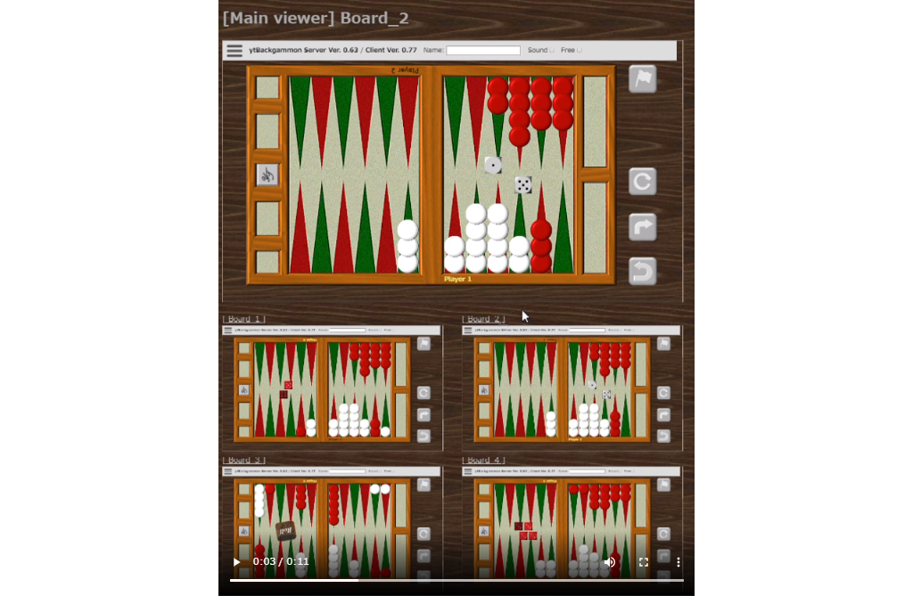
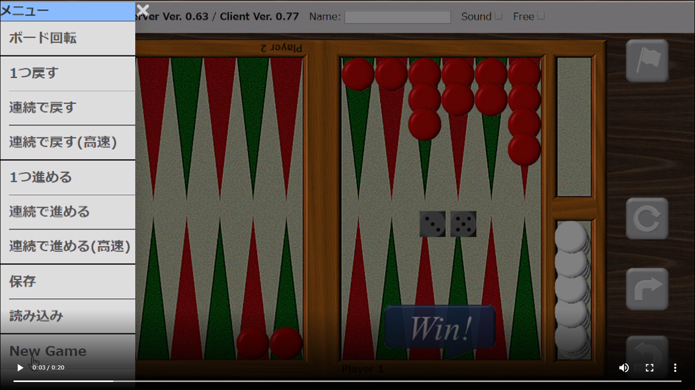
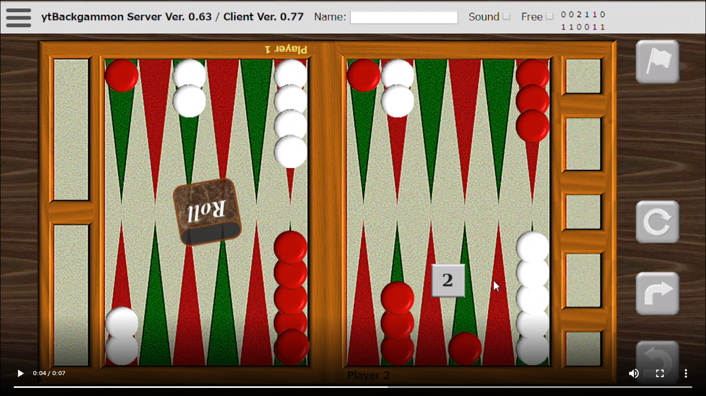
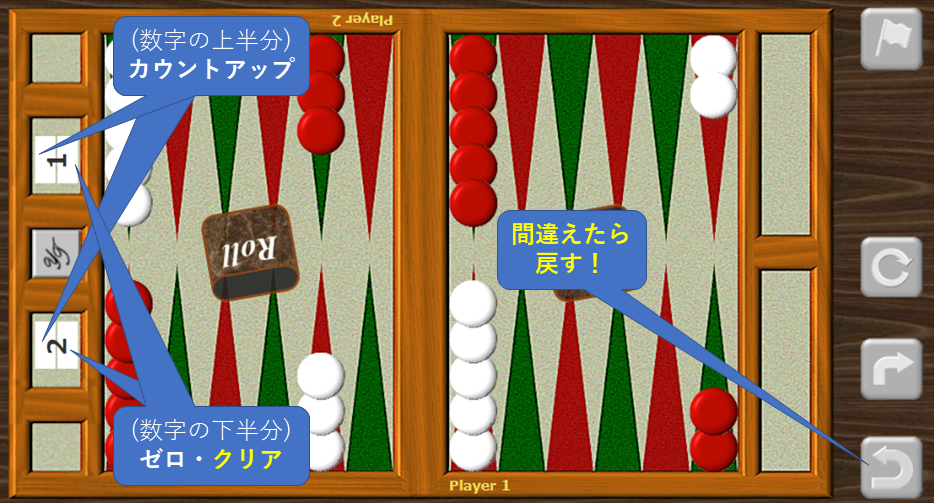

[](https://www.ytani.net/ytbackgammon/movies/ytBackgammon-demo-4boards.mp4)

# ytBackgammon -- ネットワーク共有型バックギャモンボード (Network Shared Backgammon Board)

--> [Play!!](https://www.ytani.net/ytbackgammon/)

## 特徴

通常の、ネット対戦やアプリとは違い...

カフェなどで、バックギャモンの会をやるような雰囲気を
ネット上で再現することを目指してます。

既存の対戦サイトやアプリでも、
3D表示できたり、
観戦したり、
チャットしたり
できますが、
どうしても密室でこもってやってる感じがしてしまい、
みんなで楽しくプレーする雰囲気がなかなか得られません。
(個人的な感想)

そこで、
近くで
「他の人がプレーしているのを感じられるようにできないか」
考えました。

同時にビデオチャット/音声チャットでつないで、
おしゃべりしながらお楽しみ下さい。

* 複数のボードで、複数の対戦を同時進行できます。
* 全てのボードを同時に見渡ることができますし、操作もできます。
* 操作性に関しては、厳密なルールチェックや効率より、
実際のボードの使い勝手の再現を重視しているつもりです。
* ボードを回転させて、どちらのプレーヤーの目線でも見ることができます。
* ルールを無視して、自由に動かせるモードがあります。(教育・検討用)
* いくらでも「戻して」、「やり直し」ができます。
* ボードのデザインを変えることができます。


## ドキュメント

| 文書 | 誰向けか |
|------|----------|
| [docs/Player.md](docs/Player.md) | ブラウザでボードを触ってプレーする人 |
| [docs/Admin.md](docs/Admin.md) | サーバを立てて動かす人 |
| [docs/Developer.md](docs/Developer.md) | 中の作りを知りたい人・直したい人 |


## 動作環境

### クライアント: Webアプリ

* スマホ、PCの Chromeブラウザ
(なるべく最新版をお使い下さい)

* ネットワークはなるべく高速で安定した回線をお使い下さい。
(ビデオ会議がストレスなくできるぐらい)

#### 注意事項

* 以下のような要因で、タイムラグが生じることがあります。
  - 回線品質
  - PC、スマホの性能
  - Chromeのバージョン
  
* 表示が崩れたときは、ブラウザの再読込(リロード)をしてみて下さい。

### サーバ

* OS: FreeBSD, Linux
* Python 3.14 以上
* [uv](https://docs.astral.sh/uv/)
* starlette, uvicorn (``uv sync`` が入れます)


## Usage

### 1. New game

[](https://www.ytani.net/ytbackgammon/movies/ytBackgammon-opening.mp4)


### 2. Doubling

#### 2.1 Double --> Take

[](https://www.ytani.net/ytbackgammon/movies/ytBackgammon-double-accept.mp4)


#### 2.2 Double --> Resign

[](https://www.ytani.net/ytbackgammon/movies/ytBackgammon-double-resign.mp4)


## 3. Score

スコアの計算は自動的に行われますが、
リセットしたり、修正したい場合は、手動で行うことができます。



## ytBackgammon server

### 1. Install

[uv](https://docs.astral.sh/uv/) を使います。

```bash
git clone https://www.github.com/ytani01/ytBackgammon.git
cd ytBackgammon
uv sync
```

`uv sync` が Python 3.14 の仮想環境 (`.venv`) を作り、必要なパッケージを
入れます。**タグごと clone して下さい**(バージョンを git のタグから
取っているため)。

### 2. 起動

リポジトリのディレクトリの中で実行します。

```bash
./ytbg.sh -d -p 5001 -i images1a 1     # ポート 5001、サーバID 1
./ytbg-boot.sh                         # 4 面まとめて起動 (5001〜5004)
./ytbg-stop.sh                         # 停止
```

オプションの意味、複数ボードの立て方、状態ファイルの置き場所、
困ったときの対処は **[docs/Admin.md](docs/Admin.md)** にあります。

### 3. Board Design

オリジナルのデザインを作ることができます。
以下のファイルをダウンロードして、参考にして下さい。

* [デザイン テンプレート ファイル(ZIP形式)](docs/images0.zip)

画像ファイルの保存先: `src/ytbg/webroot/static/` ディレクトリ直下


## ライセンス

Apache License 2.0 ([LICENSE](LICENSE))


## A. References 

### A.1 Starlette + WebSocket

* [Starlette](https://www.starlette.io/)
  - [WebSockets](https://www.starlette.io/websockets/)
* [uvicorn](https://www.uvicorn.org/)


### A.2 Javascript WebSocket

* [WebSocket - MDN](https://developer.mozilla.org/ja/docs/Web/API/WebSocket)


### A.3 CSS

* [CSSだけで簡単！ハンバーガーメニューの作り方](https://saruwakakun.com/html-css/reference/nav-drawer)
