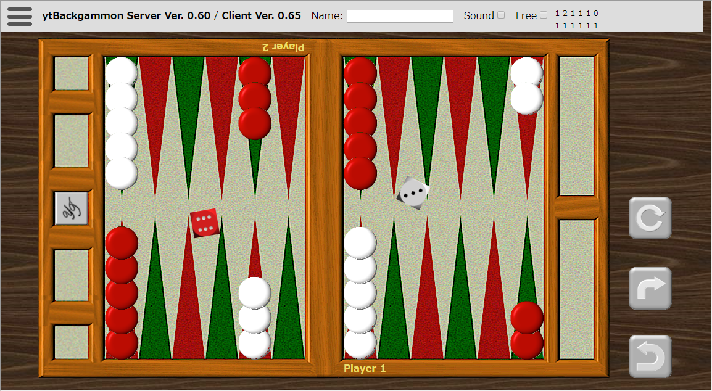
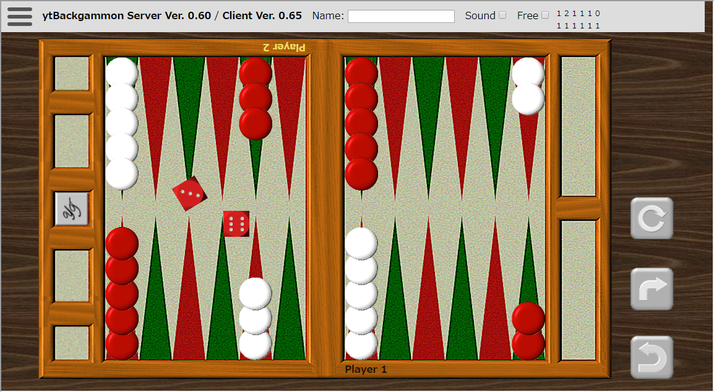

# ytBackgammon -- ネット共有型バックギャモンボード

http://www.ytani.net:8080/ytbackgammon/

## 特徴

通常の、ネット対戦やアプリとは違い...

カフェなどで、みんなでバックギャモンの会をやるような雰囲気を
目指してます。

既存の対戦サイトやアプリでも、
3D表示できたり、
観戦したり、
チャットしたり
できますが、
どうしても密室でこもってやってる感じがしてしまい、
みんなで楽しくプレーする雰囲気がなかなか得られません。
(個人的な感想)

このソフトでは、実際には同時に、
ビデオチャット/音声チャットなどで
「わいわい」やることを前提にしてます。

* 操作性に関しては、ゲームとしての使いやすさ・効率より、
実際のボードの使い勝手の再現を重視しているつもりです。
* 複数のボードで、複数の対戦を同時進行できます。
* 全てのボードを同時に見渡すことができます。
* 途中で、ボードを回転させて、どちらのプレーヤー目線でも見ることができます。
* ボードを観ている人は、誰でも、どのボードでも操作できます。
* 上級者が初心者に教えたり、いろいろ動かして議論・検討ができるように、
ルールを無視して、自由に動かせるモードがあります。
* いくらでも「戻して」、「やり直し」ができます。

## Usage

### ゲーム開始

* [メニュー]-[ゲーム開始]を選択すると下記のような画面になります。

* 両プレーヤーが、「Roll」と書かれたダイスカップをクリックすると、
それぞれ、一つずつダイスを振ります。

* どちらかのダイスをクリックすると、大きな目を出した方(先行)が2つダイスを振ったような表示に切り替ります。

* この図の場合は、赤が先行でプレーを開始します。

## Implementation

* Server: Python3, flask, flask_socketio (on FreeBSD and Linux)
* Client: javascript, socket.io

## Install

## References 

### Flask + Webscoket

* [Flask-Socket-IO](https://github.com/miguelgrinberg/Flask-SocketIO)
  - [Flask-SocketIOでWebSocketアプリケーション](https://qiita.com/nanakenashi/items/6497caf1c56c36f47be9)
  

### Javascript socket.io

* https://cdnjs.com/libraries/socket.io

### CSS

* [CSSだけで簡単！ハンバーガーメニューの作り方](https://saruwakakun.com/html-css/reference/nav-drawer)
