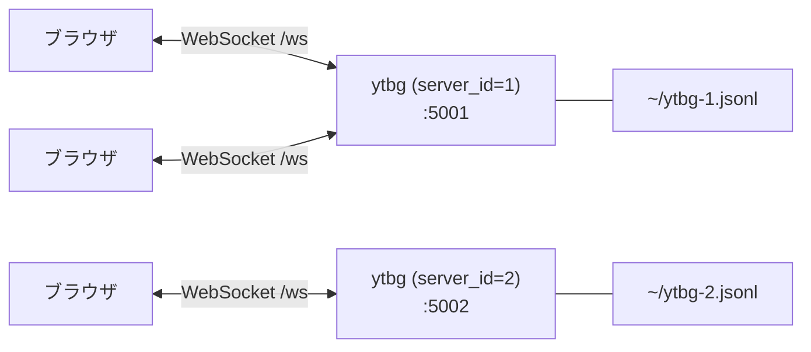
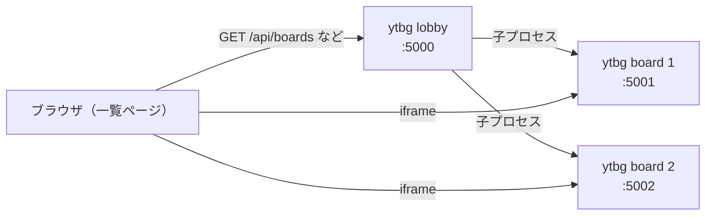
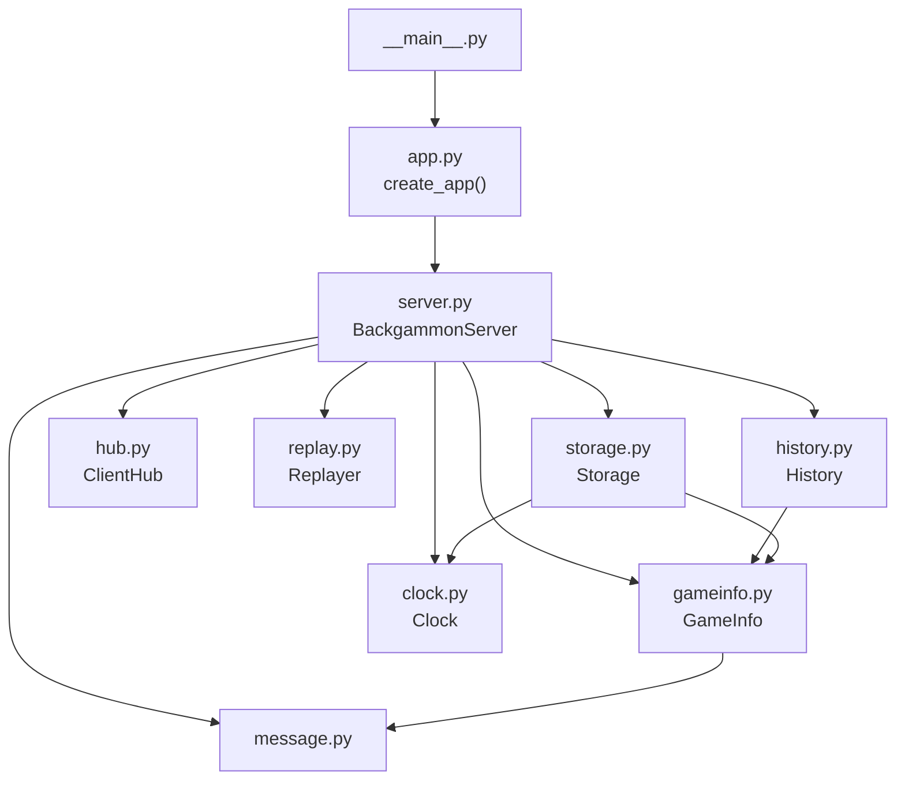
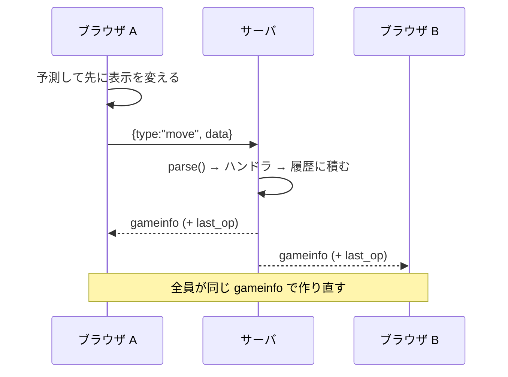
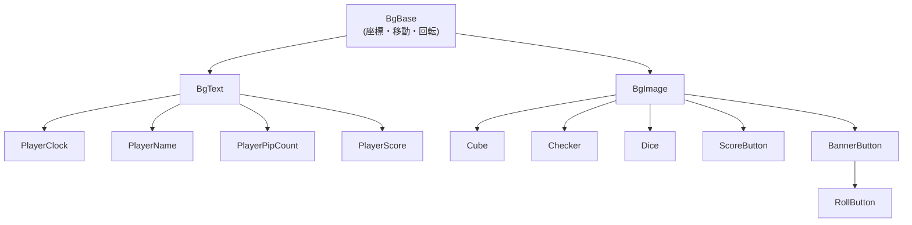

# 開発者向けガイド

このプロジェクトに新しく加わった人が、全体像をつかむための文書。
**どこに何があるか、なぜそう分かれているか、どこから読み始めるか**を書く。
細かい処理はコードを読めば分かるので、ここには書かない。

遊び方は [Player.md](Player.md)、サーバの動かし方は [Admin.md](Admin.md) にある。

## 何を作っているのか

**1 枚のボードを全員で共有して、誰でも自由に触れる**バックギャモンボード。
対戦相手を組ませるゲームサーバではない。観戦している人も駒を動かせる。
ルールチェックは補助で、free move モードで無効にできる。

この目的が実装のあちこちに効いている。

- **サーバはルールを判定しない。** 判定はクライアントが行い、その結果を送る。
  サーバは送り主を確かめず、認証もプレーヤーの割り当ても無い（同じ操作が
  2 回届いたときのために、今の盤面と合わない操作だけは捨てる）
- **サーバは盤面を預かるだけ。** 届いた操作を盤面に反映して、全員へ配り直す
- **操作の結果を待たせない。** ドラッグを離した瞬間、クライアントは自分で
  結果を予測して表示を変える（後述の「先行実行」）

## 全体の形

**サーバ 1 プロセス ＝ ボード 1 面。** 複数のボードは、`server_id` を変えた
プロセスを別のポートで起動して並べる。状態ファイルもクッキーの名前も
`server_id` で分かれる。



`ytbg lobby` は、設定ファイル（`ytbg.toml`）のボードを子プロセスとして起動し、
iframe で並べる一覧ページを出す別のサーバ。**ボードの中身には関わらず**、
子プロセスの起動・停止と状態の表示だけを受け持つ。



## サーバ側（`src/ytbg/`）

パッケージ名は `ytbg`。`templates/` と `static/` は `src/ytbg/webroot/` の下にある。

| モジュール | 含むもの |
|------------|----------|
| `__init__.py` | パッケージの定数。`webroot/` の絶対パスもここ |
| `__main__.py` | エントリポイント。click の group `main()` と、サブコマンド `board`・`lobby` |
| `app.py` | `create_app()`。ルーティングと WebSocket の受信ループ |
| `server.py` | `BackgammonServer`。メッセージの分岐と、全体のとりまとめ。`parse()` と登録表もここ |
| `message.py` | 届いたメッセージの `data` の型（dataclass）と例外 |
| `gameinfo.py` | `GameInfo` / `BoardState` / `CubeState`。盤面の状態そのもの |
| `clock.py` | `Clock`。持ち時間と残り時間 |
| `history.py` | `History`。戻す側と進む側の 2 つのスタック |
| `hub.py` | `ClientHub`。つないでいる WebSocket と、全員への送信 |
| `replay.py` | `Replayer`。連続再生の Task を 1 本だけ持つ |
| `storage.py` | `Storage`。JSON Lines での保存・読み込み |
| `mylog.py` | ログ（loguru） |
| `lobby.py` | 一覧サーバ。設定の読み込み `load_config()`、子プロセス 1 つぶんの `BoardProcess`、`create_lobby_app()` |



**読み始めるなら `server.py` の `on_json()`。** そこから
登録表 `MESSAGE_TYPES` と、各ハンドラへ辿れる。

### 役割の分け方

- **`app.py` は HTTP と WebSocket の口だけ**を持つ。受け取ったメッセージの
  処理は `BackgammonServer` に渡すが、**例外が起きたときに接続を続けるか
  切るかは受信ループが決めている**
- **`BackgammonServer` は HTTP の応答を持たない。** `index.html` を返すのは `app.py`
- **`History` は保存を持たない。** 保存にはクロックと `Storage` が要るので、
  そこは `BackgammonServer` の担当
- **`BackgammonServer` に `broadcast()` を呼ぶだけのメソッドは無い。**
  送信は `ClientHub.broadcast()` を直接呼ぶ

### 気をつけること

- **全員への送信は、いちばん遅いクライアントを待つ。** `broadcast()` は
  `asyncio.gather()` で並行に送るが、全員へ送り終わるまで次へ進まない。
  1 つ詰まると、他のクライアントへの配信も、連続再生の次の 1 手も止まる。
  なくすには、クライアントごとの送信キューが要る
- **`GameInfo.from_dict()` は、必須のキーが無ければ必ず `KeyError` にする。**
  黙って初期配置で補うと、壊れた保存ファイルが「初期配置の N 手」として
  読まれてしまう。dict でないもの（`"board": null` など）も入口で `KeyError` に
  する。読み込みで拾う例外（`storage.py` の `LOAD_ERRORS`）に `TypeError` は
  入っていないので、`TypeError` のまま出るとサーバが起動しない

### 一覧サーバ（`lobby.py`）

ボードは `sys.executable -m ytbg board ...` で子プロセスとして起動する
（`asyncio.create_subprocess_exec`）。API は `GET /api/boards`（状態の一覧）と
`POST /api/boards/{server_id}/start`・`/stop`。一覧ページ（`templates/lobby.html` と
`static/js/lobby.js`）は 3 秒ごとに `/api/boards` を読み直す。

- **子プロセスの面倒を見る範囲は狭い。** 起動時に全部起動し、lobby が止まるとき
  （Starlette の lifespan の終わり）に全部止める。落ちたボードは起動し直さず、
  lobby の外で動いているボードも探さない。lobby を SIGKILL で殺すと子が残る
- 停止は SIGTERM を送り、5 秒で終わらなければ SIGKILL
- 子の stdout と stderr は lobby のものをそのまま使う。起動できない理由はそこに出て、
  lobby は終了コードだけをログに出す
- API の状態は `running`（プロセスがある）と `listening`（lobby がボードのポートへ
  `127.0.0.1` で接続できた）の 2 つ。一覧ページは両方偽を「停止中」、`running` だけを
  「起動中」、両方真を「動作中」と出す。**接続できるかしか見ない**ので、lobby の外の
  プロセスが同じポートを塞いでいると、子が起動に失敗して終わるまでの一瞬は「動作中」になる
- 子は lobby と同じプロセスグループにいる。端末の Ctrl+C はボードにも直接届くので、
  lobby が止めに行く前にボードが終わっていることがある
- 一覧ページは iframe を作り直さない（作り直すと読み込み直しになる）。大きく出す
  ボードは class と CSS の `order` だけで入れ替える。iframe の `src` は、`listening` が
  偽から真に変わったときだけ入れる（最初の読み込みも同じ）。**listen する前に入れると、
  iframe が接続エラーの画面のまま戻らない**

## 状態の持ち方

盤面の状態は `GameInfo`（dataclass）。`sn`（通し番号）、`server_version`、
`game_num`、`match_score`、`score`、`turn`、`resign`、`board`（`playername` /
`cube` / `dice` / `checker`）。**履歴に積まれるのもこれ。**

- チェッカーは `checker[player][i] = [point, idx]` の配列で、**ID は
  `player * 100 + i`**。`idx` はそのポイントでの積み順。クライアントの
  `Checker` はプレーヤーと通し番号を数値で持つ
- **チェッカーの位置は、クライアントもこの `checker` でしか持たない。**
  ポイントは `layout.js` の座標計算（`checker_geometry()` と当たり判定の
  `point_at()`）だけで、「そのポイントにどの駒があるか」は毎回 `gameinfo` から
  引く（`rules/position.js` の `checkers_at()`）。駒の積み順を決めているのは
  `rules/position.js` の `checker_order()` だけで、`Position.from_gameinfo()` も
  表示の配り直し（`BoardView.render()`）もこれを使う
- ポイント番号は 0〜25 が盤上（0 と 25 がゴール）、**26 と 27 がバー**。
  プレーヤー 0 は番号が減る方向、1 は増える方向へ進む

**クロックは `GameInfo` の中に入れない。** 入れると履歴に載り、「1 つ戻す」で
クロックの発着まで巻き戻ってしまう。クロックは `Clock` が別に持ち、
配信のときだけ `clock_state` として添える。

## 通信

WebSocket のパスは `/ws`。メッセージは JSON 1 本。

- **クライアント → サーバ**: `{src, type, data}`。**1 つの操作を 1 通で送る**
- **サーバ → クライアント**: `gameinfo` 1 本だけ。`data` に盤面のほか、
  直前の操作が `last_op` として入る

**`type` の分岐はサーバ側にしか無い。** クライアントは届いた `gameinfo` で
盤面を作り直し、**音とダイスの回転だけを `last_op` から決める**。

ping は uvicorn の既定（20 秒ごと）に任せる。ブラウザが pong を自動で返すので、
JS 側には何も要らない。
接続が切れると、クライアントは 1 秒から倍にしながら（上限 10 秒）つなぎ直す。
つなぎ直せばサーバが `gameinfo` を丸ごと送るので、**取りこぼした差分を
埋める仕組みは持たない。**

クライアントは、プレーヤー番号などを**数に直してから送る。** Cookie から
読んだ値は文字列のことがあり、サーバが型の合わない値として弾く。



### 操作の種類

ゲームを進める操作には名前が付いている。クライアントが載せるのは
**ルールを判定した結果だけ**（どの駒をどこへ動かすか、何点になるか、など）で、
手番の受け渡し・キューブの値・得点の足し算・クロックの切り替えは、
サーバが自分の持つ盤面をもとに行う。

| type | 何をするか |
|------|------------|
| `roll` | ダイスを振った目を入れる |
| `opening` | オープニングロールで先手を決める |
| `move` | 駒を動かし、ダイスを使う。勝ちなら得点を足す |
| `end_turn` | 手番を相手に渡す |
| `double` / `take` / `cancel_double` | キューブ |
| `resign` | 投了 |

このほか、free move での移動（`put_checker`）と目の変更（`dice`）、名前、
得点の ▲▼、クロック、履歴の操作の type がある。

**サーバは、今の盤面と合わない名前付きの操作を捨てる**（テイク済みのキューブへの
`take` など）。2 人がほぼ同時に同じ操作をしても、2 回ぶん効かないようにするため。
ルールの判定そのものはクライアントが行う。

### 登録表

届いたメッセージは `server.py` の `parse()` が、`type` ごとの frozen dataclass に
組み立てる。**`data` のキーが足りない、または値の型が合わなければ、
盤面を書き換える前に例外になる。**

- `data` はすべての type で必須。中身を使わない type（`back`、`clear_hist`
  など）でも、キーが無ければ例外になる
- 値の型は、dataclass のフィールドの注釈と照らす（`list[X]` は中身まで）。
  `bool` は `int` のサブクラスだが、`int` と `float` のフィールドには通さず、
  `bool` のフィールドに 0 / 1 も通さない。`float` のフィールドには `int` も通す
- **`list` のフィールドは、組み立てるときに `list()` で写さない。** 写すと
  文字列も list になり、型を確かめても弾けない。届いた list を盤面と
  共有しないように写すのは、受け取る側（`GameInfo` と `Clock`）

`on_json()` は `server.py` の 1 つの登録表 `MESSAGE_TYPES` で動く。1 行が
「`data` の dataclass・ハンドラ・履歴に積むか」で、**type を足すときに直すのは
この表（と dataclass とハンドラ）だけ**。音やダイスの回転が要るときは、クライアントの
`board_controller.js` の `effects_for()` にも足す。登録表に無い `type` は、警告を出して無視する。

履歴に積むかは type ごとに決まっている。名前付きの操作と、盤面を書き換える
free move・名前・得点の操作は積む。クロックの操作は `GameInfo` を書き換えないので
積まない。**1 つ前と `sn` 以外が同じエントリも積まない。**

ハンドラはすべて `async def` で、**戻り値によって、そのあと `on_json()` が
履歴に積んで全員へ配るかどうかが決まる**。

| 戻り値 | 意味 |
|--------|------|
| `None` | ハンドラが自分で送信済みか、盤面と合わないので捨てた。`on_json()` はそのまま終わる |
| `float` | アニメーションの秒数。勝負がついたらクロックを止め、履歴に積んで、全員へ配る |

クロックを止めるのは、**`turn` がその操作で -1 に変わったときだけ。**
処理の前から -1 なら止めない（勝負がついたあとでも、クロックを押せば
再開できるように）。履歴の操作（戻す・進める・連続再生）で勝負のついた
盤面になったときも止めない。

### 先行実行（予測）

共有ボードなので、サーバの返事を待つと操作感が悪い。ドラッグを離した瞬間、
`rules/actions.js` の `plan_move()` が**動かしたあとの `gameinfo` を自分で作り**、
その予測から `move` の中身（駒の積み順、使ったダイス、勝ちの点数）を求める。
クライアントはそれを送ってから、予測で表示を変える。

- `plan_move()` は渡された `gameinfo` を書き換えない。駒の移動元も `gameinfo` から読む
- 予測は、動かしたチェッカーの `[point, idx]` と、そのプレーヤーのダイスを書き換える。
  使った目と使えなくなった目は 11〜16 にする（目が 0 のダイスは 0 のまま）。`sn` は進めない
- ヒットのときは 2 手ぶん（相手をバーへ、自分を移動先へ）
- **予測が外れても、サーバから届く `gameinfo` で表示は戻る**
- 予測に失敗したら何も送らない
- free move の駒の移動は予測しない（ルール判定を通らないので行き先を確かめられない）
- **予測は `BoardController.predict()` で表示し、クロックの基準と演出には触れない。**
  触ると、クロックは古い残り時間から数え直しになり、音は返事の分と二重に鳴る
  （サーバから届いたときの入口 `receive()` だけが、`clock_state` と `last_op` を読む）
- 予測した `gameinfo` は、表示したあとそのまま `BoardController` の `gameinfo` になり、
  次の予測はそれを土台にする（返事を待たずに続けて操作した分が効くのはこのため）。
  そのかわり、予測を表示してから返事が届くまでの間に、他のクライアントの
  操作による `gameinfo` が届くと、予測で変えた表示がいったん戻る。サーバの返事で必ず直る

free move での目の変更と、得点の ▲▼（free move に限らない）も、
予測した盤面を先に表示してから送る。表示部品は値の写しを持たないので、
先に表示を変えないと、返事が届く前に続けて押した分が消える。

- **続けて押している途中で返事が届くと、押した分が消えることがある**
  （届いた `gameinfo` を土台に、同じ値を送り直すため）
- Roll を押した直後に ▲ や free move のダイスを押すと、予測の表示で
  Roll ボタンがもう一度出ることがある（ダイスがまだ 0 のため）

離したときの流れは、`BoardView` の中の `Drag` が掴んでいたものを外し、
`BoardController.drop_checker()` に駒の ID とポイント番号を渡す。
`drop_checker()` は `BoardController.plan_move()` を通して `rules/actions.js` の
`plan_move()`（`decide_dst()` で行き先とヒットを決め、予測と送る `move` を作る）を
呼び、`move` を送ってから予測を `predict()` する。
`false` が返ったら（行けない、予測に失敗した）、`Drag` が駒を元の位置へ戻す。
予測の入口は `BoardController.plan_move()` の 1 か所で、ブラウザテストはここを
差し替えて予測を外す・失敗させる（ES Modules の export は外から差し替えられないため）。

**掴んでいた駒を外してから `drop_checker()` を呼ぶ順番は変えないこと。**
`BoardView.render()` は掴んでいる駒を手元の座標に残すので、逆にすると先行実行の
表示で駒が動かない。**この順番はテストでは守られない**（逆にしてもテストは通る）。
駒を押したときは、**押した駒を掴めるか確かめてから**、そのポイントの先端の駒へ
持ち替える。

### 音とダイスの回転

`last_op` から決めるときに、次の点に気をつける。

- `move` は、`turn` を見ずに駒を置く音を鳴らす。勝ちになる `move` では、
  届く `gameinfo` の `turn` がもう -1 になっている
- `move` のヒットの音は、`moves` にバー（26 以上）へ動かすものがあるかで決める。
  動かす前の位置を見ると、先行実行した画面では駒がもうバーにあって見分けられない
- `opening` / `end_turn` の手番の音は、`turn` が変わったかを見ない。
  `turn` が 0 / 1 になるときだけ鳴らす（同じ目の `opening` で 2 に戻るときは鳴らない）

## 履歴

戻す側（`_history`）と進む側（`_fwd_hist`）の 2 つのスタック。
戻すと `_history` から pop して `_fwd_hist` へ積む。

連続再生（最初まで戻す・最後まで進める）は Task で走り、1 手ずつ間を置いて配る。
**再生中に別の再生要求が来ると、前の Task を止めてから始める。**
Task の差し替えは `Replayer` の中のロックでまとめて行う。そうしないと、
止めるのを待つ間に別の要求が入り込み、どこからも辿れない再生 Task が残る。

n 手ぶんの「戻す・進める」は Task にせず、その場で走り切る。Task にすると、
2 人が同時に押したときに片方が取り消されて 1 手分失われる。

- **履歴に積まなかったときも、進む側は必ず捨てる。** 直前と `sn` 以外が同じ
  エントリは積まないが、New Game のように盤面がたまたま直前と同じになる
  操作でも、利用者の意図は「進む側を捨てる」ことなので、盤面が変わったかとは
  別に扱う
- 「履歴を削除」も、走っている連続再生を止めてから消す（`Replayer.run()` を通す）。
  止めずに消すと、再生の Task が差し替えたあとの履歴を pop し続ける。
  連続再生の途中で押すと、止まった時点の盤面が残る

保存は `~/ytbg-{server_id}.jsonl`（JSON Lines）。1 行目がメタ（形式のバージョンとクロック）、
以降が履歴。1 行 1 手なので読みやすい。各行は `json.dumps()` で書くだけなので、
`GameInfo` にフィールドを足しても保存側を直す必要が無い。
日本語のプレーヤー名をそのまま書く（`ensure_ascii=False`）ので、
`open()` には `encoding='utf-8'` が要る。

## クロック

表示を進めるのはクライアントだけだが、残り時間の基準はサーバの `Clock` も持つ。
配信のたびに `clock_state` を添えるので、あとからつないだ画面も、動いている
表示に戻せる。

- `sw`（クロックを使うか）の初期値は `True`。`index.html` の Clock の
  チェックボックスが既定で入っているので、`False` にすると、つないだ画面が
  `clock_state` を受けてチェックを外してしまう
- 保存するのは持ち時間・`sw`・残り時間で、**動いているかどうかは保存しない。**
  サーバが落ちている間の時間は数えられないので、読み込んだら必ず止まった状態から始める
- 持ち時間と `sw` の変更は履歴に積まないので、ハンドラが自分で保存する
  （しないと、変えたあと再起動すると元に戻る）

クライアントでは、`BoardController` が基準の残り時間・`active`・`sw`・`limit` を
持ち、**サーバから届いた `clock_state` だけから作る。** 履歴の返事でも全部反映する
（クロックは履歴の対象外なので巻き戻らない）。表示は 200 ms ごとに
`snapshot(now)` で計算し、`BoardView.render_clock()` に渡す。

- **ヘッダの Clock のチェックボックスは `set_clock_switch` を送るだけ。**
  計算も時計の表示・非表示も、チェックボックスの表示も、返事の `clock_state` で変わる
- クロックを押したときの `stop_clock` / `resume_clock` は、`BoardController` の
  `active` と `sw` から選ぶ
- 最初の返事が届く前の設定は、ヘッダの HTML の初期値から作る

## クライアント側（`src/ytbg/webroot/static/js/`）

**ES Modules で、バンドラは使わない。** `index.html` は
`<script type="module" src="/static/js/main.js">` の 1 行で読み込む。
キャッシュ避けはサーバ側で、`/static` も `index.html` も
`Cache-Control: no-cache` で返す。

| モジュール | 役割 |
|------------|------|
| `main.js` | エントリ。DOM を作り、画像を待って `Settings`・`BoardView`・`BoardController` を組み、ヘッダ・メニュー・キーボードをつなぎ、WebSocket をつなぐ |
| `dom.js` | 盤面の要素を作って返す（チェッカー 30 個、ダイス 8 個など） |
| `board_controller.js` | `BoardController`。盤面の状態（`gameinfo`）・履歴の番号・クロックの基準、操作ごとのメソッド、先手決めと時計のタイマー。`effects_for()`（鳴らす音と回すダイス） |
| `board_view.js` | `BoardView`。表示部品と入力、`render()`・`render_clock()`・`play_effects()`。掴む・動かす・離すの `Drag` |
| `ws.js` | 接続・再接続・送信 |
| `layout.js` | 盤面の座標（部品の位置、駒の積み位置 `checker_geometry()`、ポイントの当たり判定 `point_at()`） |
| `settings.js` | `Settings`（音、free move、PIP の表示、プレーヤー番号）、Cookie、クエリ文字列、`<body>` の `data-*` |
| `sound.js`, `log.js` | 音、ログ（`?debug` を付けて開いたときだけ出す） |
| `rules/` | ルール層（純粋関数） |
| `ui/` | 表示部品 |

**`index.html` の中身は `<header>` と空の `<div id="board">` だけ**で、
盤面の要素は `dom.js` が作り、`main.js` が `BoardView` に渡す。表示部品は
id で要素を探し直さず、渡された要素を使う。

```text
main.js ── 組み立て・起動
  ├─ BoardController ── rules/
  │       ├─ 送信関数（ws.js の emit_msg）
  │       └─ BoardView ── ui/・layout.js・Drag
  └─ Settings・音
```

**状態の持ち主は `BoardController` だけ。** サーバから届いた `data` は
`receive()` が受け取り、変更前の盤面を控え、`gameinfo` とクロックの基準を
置き換え、`BoardView.render(snapshot)` で描画してから `play_effects()` で
音とダイスの回転を出す。`BoardView` は snapshot を保存も書き換えもせず、
その場で描画する。

**サーバへ送るのは `BoardController` だけ**（送信関数は `main.js` が渡す）。
`BoardView` は入力を受けると、`connect()` で受け取った `BoardController` の
メソッドを、駒の ID・値・盤面の座標で呼ぶ。`BoardView` と `ui/` は
`BoardController` を import しない。「押してよいか」の判定は `rules/actions.js` が、
表示部品が持つ値ではなく `BoardController` の `gameinfo` とチェッカーの ID から行う。
表示部品に残っている盤面の値は `Checker.cur_point` だけで、`render()` が
`gameinfo` と一緒に書き直す。
`gameinfo` がまだ届いていないときは、盤面を読む操作（ロール、ダイス、チェッカー、
キューブ、投了、得点）は何もしない。名前・クロック・履歴の操作は送る。

`main.js` はデバッグ用に `window.board = {controller, view}` を公開する。

キャッシュ避けを `?ts=` 付きの URL で行わないのは、`import` した先の
モジュールに効かないため。`<meta http-equiv>` も今のブラウザは見ないので、
`Cache-Control` はサーバが付ける。

### 気をつけること

- **モジュールの中で素の `board` を書かないこと。** `index.html` に
  `<div id="board">` があり、id を持つ要素は
  `window` の名前付きプロパティになるので、`window.board`（デバッグ用）が
  無くても ReferenceError にならず、黙って DIV を掴む
- **盤面の要素は、画像の読み込みより前に作る。** `BgImage` は `` の幅と
  高さから大きさを決めるので、読み込み前に `BoardView` を組むと幅が 0 になって
  配置が崩れる。これを防いでいるのは、`main.js` が `build_dom()` をモジュールの
  評価時（`load` より前）に呼んでいること。そこで作った `` が `load`
  イベントを遅らせるので、`window.onload` の時点で読み込みが済んでいる。
  `dom.js` の `wait_images()` は、この順番が崩れたときの備えで、今は常に
  すぐ終わる。**どちらもテストでは守られない。** 順番を変えるときは、
  画像の応答を遅らせて配置を実測すること
- 要素の id 属性は、`tests/browser/` が要素を探すためだけに残してある
- `Drag` は、掴んだ位置をチェッカー用とキューブ用で別に持つ。free move なら
  マルチタッチで両方を同時に掴めるので、1 組にするとキューブを離したときに
  テイクやリダブルが送られない
- **受信しても、掴んでいる駒とキューブは見た目の座標と z を手元に残す。**
  共有ボードなので、掴んでいる間にも他の人の操作で `gameinfo` が届く
- 振ったダイスの回転は、`render()` がダイスを置いた直後、スタイルが確定する前に
  `play_effects()` が掛ける。`render()` の中でダイスを最後に置いているのはこのため
  （間に要素の大きさを読む処理が入ると、ダイスが出てくる動きが消える）
- 入力のリスナーは、要る部品にだけ `BoardView.listen()` がつなぐ。押す・離す・
  動かすの 3 つとも登録し、使わないものも既定の動作（スクロールや選択）を止める。
  盤面の要素にもつないであるので、中の文字（PIP など）を押しても選択にならない
- 先手決めで Roll を押したあとの 2 秒後の自動クリックと、200 ms の時計の更新は
  `BoardController` のタイマー。受信のたびに予約し直さない。自動クリックは、
  予約するときに相手のダイスが出ているかを見て、実行するときの最新の盤面で判定する
- `?sound=`（`=` はあるが値が空）は「値が無い」扱いで、音が鳴る側になる。
  `URLSearchParams` では `?sound` と区別できないため

### ルール層（`rules/`）

**DOM も表示部品も見ず、値を返すだけ。** import してよいのは `rules/` の中だけ。

| ファイル | 中身 |
|----------|------|
| `position.js` | `Position` と `goal_point()` / `bar_point()` / `get_pip()` / `copy_gameinfo()` / `checker_order()` / `checkers_at()` / `active_dice()` / `has_dice()` |
| `move.js` | `calc_dst_point()` / `all_inner()` / `dst_point()` / `dst_points()` / `usable_dice()` / `disable_unusable()` / `dice_for_move()` |
| `judge.js` | `pip_count()` / `calc_gammon()` / `winner_is()` / `closeout()` |
| `actions.js` | 操作ごとの判定と送る内容（`can_pick_checker()` / `decide_dst()` / `plan_move()` / `plan_put_checker()` / `plan_roll()` / `plan_dice_click()` / `can_hold_cube()` / `plan_double()` / `plan_cube_drop()` / `plan_resign()` / `plan_score()`） |

`rules/actions.js` の `plan_*()` は、成り立たなければ `null`、成り立てば
`{message: {type, data}}` と、要るときだけ `predicted`（予測した `gameinfo`）を返す。
表示の指示は返さない。判定の無い操作（`end_turn`、`take`、`cancel_double`、名前・
履歴・時計の設定）には plan の関数を作らない。`take` / `cancel_double` と、ダイスを
使い切ったあとの `end_turn` は、判定のある `plan_cube_drop()` / `plan_dice_click()` が
返す。パスのバナーの `end_turn` と、名前・履歴・時計の設定は `BoardController` が直接送る。
乱数（ダイスの位置と目）は `BoardController` が作って `plan_roll()` に渡す。

表示の更新は `BoardView` の側で行う。バナー・PIP・名前の強調は、`render()` が
snapshot の `gameinfo` から `Position` を作り、`rules/` の判定で決める。

**この層だけが `node --test tests/js/` で単体テストできる。**
DOM を触るクラスは単体テストせず、ブラウザでの確認で見る。

### 表示部品（`ui/`）



**表示部品は、盤面の状態・`Settings`・操作の関数を参照しない。** DOM の移動・
回転・表示だけを受け持ち、渡された値を表示する。`player` は中間クラスを作らず、
コンストラクタの options で渡す。入力の座標は、`BgBase.get_xy()` が
`BoardView` から渡された変換（盤面の位置と向き）で盤面の座標に直す。
押したときの処理を持つ部品は無く、`BoardView` がつなぐ。

盤面の画像と、投了・戻す・進める・回転のボタンは、ただの `BgImage`。
Roll ボタンはダイスを持たず、ダイスは `BoardView` が Roll ボタンの横に並べて持つ。
`Dice.set()` は目の画像・不透明度・定位置を、`animate_roll()` は回転だけを受け持つ。

部品の座標は `layout.js` が計算して返し（`point_geometry()` /
`checker_geometry()` / `score_geometry()` / `label_geometry()`）、部品を作るのは
`BoardView` のコンストラクタ。`layout.js` は何も import しない。

**盤面を表示に反映するのは `BoardView.render()` だけ。** サーバから届いた
`gameinfo` も、先行実行の予測も、同じ入口を通る（時計の毎回の更新と、押した直後に
Roll ボタンやパスのバナーを隠す操作を除く。隠したものは次の描画で状態から決め直す）。

## テスト

| 対象 | 走らせ方 |
|------|----------|
| Python | `uv run pytest` |
| JS のルール層 | `node --test tests/js/` |
| ブラウザでの動作 | `node --test tests/browser/` |

`node --test` は Node の標準機能なので、**npm パッケージは要らない**
（playwright が要るのは `tests/browser/` だけ。最初の 1 回だけ `npm install`）。

`tests/browser/` は、サーバを実プロセスとして起動し、chromium でページを開いて見る。

- 保存先は環境変数で一時ディレクトリへ逃がすので、**自分のボードのファイルは
  読み書きされない**
- ポートは固定せず、空いているものを OS に選ばせる
- **ブラウザはシステムの `/usr/bin/chromium` を使う。**
  `npx playwright install` で落とし直さないこと
- 既定はヘッドレス。動きを目で見たいときは、画面を表示して走らせる

  ```bash
  npm run test:browser             # ヘッドレス（node --test tests/browser/ と同じ）
  npm run test:browser:headed      # 画面を表示し、ファイルを 1 つずつ走らせる
  YTBG_TEST_HEADED=1 YTBG_TEST_SLOWMO=300 node --test tests/browser/drag.test.mjs
  ```

  `YTBG_TEST_HEADED` は空でも `0` でもない値で画面を表示する（X の `DISPLAY` が要る）。
  `YTBG_TEST_SLOWMO` はミリ秒で、マウス・キーボード・`goto` などの操作ごとに待ちを
  入れる（`page.evaluate()` には入らない）。マウスを離したあとの待ちの間に
  サーバの返事が届くので、先行実行の表示を見るテストは返事の表示を読むことになる。
  **通るかどうかの確認は、待ちを入れずに行う**

### テストを書くときに気をつけること

- **通ることだけを見ない。** `src/` をわざと壊して、狙ったテストが落ちることを
  確かめる。過去に、送信をすべて止めても 1 件も落ちない状態が見つかっている
- `tests/js/helper.mjs` の初期配置は `src/ytbg/gameinfo.py` の写し。
  **初期配置を変えるときは両方を直すこと**
- Python のテストは `asyncio_mode = "auto"` なので `async def` をそのまま書ける
- **`tests/browser/` のテストは、ページの中の `board` を直接触らない。**
  盤面を読む、届いた盤面を反映させる、予測を差し替えるといった操作は
  `tests/browser/helper.mjs` の関数を通す。クライアントの構成を変えたときに、
  テスト本体を変えずに helper の中だけを直せば済むようにするため。
  返事が届く前に読む必要があるものは、helper の 1 つの関数の中で押して読む

## 型チェックと lint

```bash
uv run ruff check .
uv run mypy src
uv run basedpyright
```

`basedpyright` は Emacs の eglot が使う言語サーバと同じものなので、
**エディタに出る指摘と出力が揃う。** 水準は `pyproject.toml` で `standard` にしてある。

`float` を渡す引数に `int` と書くと、**mypy は通すが basedpyright は落ちる**
（mypy には int の引数へ float を渡せる特例がある）。

## 書き方の慣習

- ログは loguru。クラス本体に `__log = getLogger(__qualname__)` を置く
- `loggerInit(debug)` は入口で 1 度だけ呼ぶ。`main()` 以外の入口
  （`tests/conftest.py` など）でも呼ばないと、loguru の既定のハンドラが残り、
  DEBUG が全部 stderr に出る
- **ログのメッセージは f-string にせず、`{}` と引数で渡す**。
  loguru の書き方に合わせ、値を引数のまま残すため。速さのためではない。
  `mylog.py` はハンドラを `level=0` で足してフィルタで水準を見るので、
  抑制される水準のログでも文字列は組み立てられる。そのため、引数を渡したうえで
  メッセージにリテラルの `{` `}` を書いたり、`{}` より引数が少なかったりすると、
  抑制される水準でも実行時に例外になる
- コード内のコメントと docstring は日本語と英語が混ざっている。周りに合わせる
