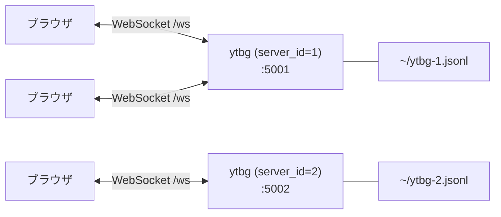
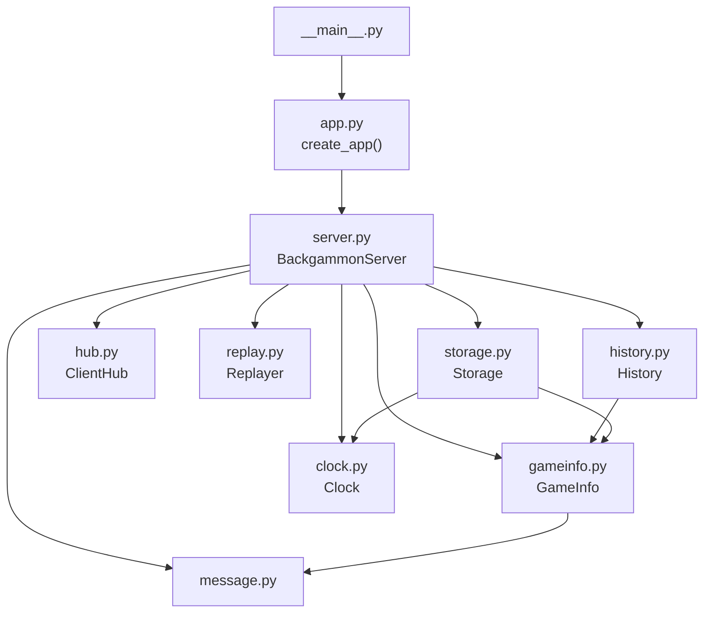
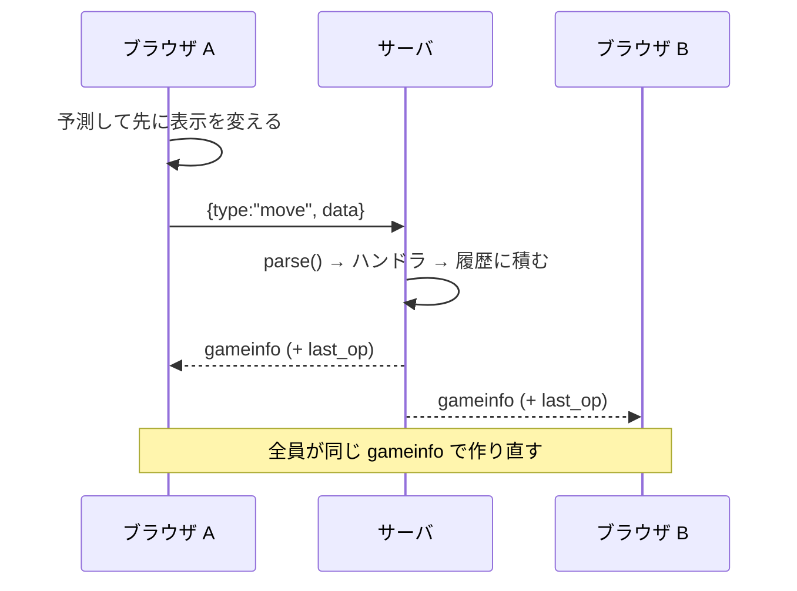
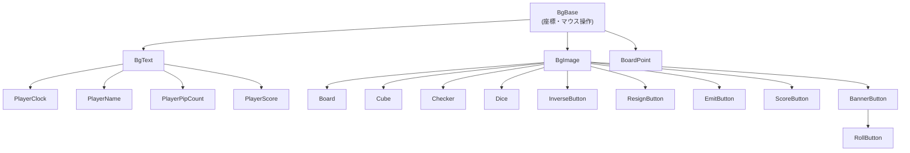

# 開発者向けガイド

このプロジェクトに新しく加わった人が、全体像をつかむための文書。
**どこに何があるか、なぜそう分かれているか、どこから読み始めるか**を書く。
細かい処理はコードを読めば分かるので、ここには書かない。

遊び方は [Player.md](Player.md)、サーバの動かし方は [Admin.md](Admin.md) にある。

## 何を作っているのか

**1 枚のボードを全員で共有して、誰でも自由に触れる**バックギャモンボード。
対戦相手を組ませるゲームサーバではない。観戦している人も駒を動かせる。
ルールチェックは補助で、free move モードで無効にできる。

この目的が実装のあちこちに効いている。

- **サーバはルールを判定しない。** 判定はクライアントが行い、その結果を送る。
  サーバは送り主を確かめず、認証もプレーヤーの割り当ても無い（同じ操作が
  2 回届いたときのために、今の盤面と合わない操作だけは捨てる）
- **サーバは盤面を預かるだけ。** 届いた操作を盤面に反映して、全員へ配り直す
- **操作の結果を待たせない。** ドラッグを離した瞬間、クライアントは自分で
  結果を予測して表示を変える（後述の「先行実行」）

## 全体の形

**サーバ 1 プロセス ＝ ボード 1 面。** 複数のボードは、`server_id` を変えた
プロセスを別のポートで起動して並べる。状態ファイルもクッキーの名前も
`server_id` で分かれる。



`ytbg.html` は、複数のボードを iframe で並べるだけの静的なページ。

## サーバ側（`src/ytbg/`）

パッケージ名は `ytbg`。`templates/` と `static/` は `src/ytbg/webroot/` の下にある。

| モジュール | 含むもの |
|------------|----------|
| `__init__.py` | パッケージの定数。`webroot/` の絶対パスもここ |
| `__main__.py` | エントリポイント。click の `main()` だけ |
| `app.py` | `create_app()`。ルーティングと WebSocket の受信ループ |
| `server.py` | `BackgammonServer`。メッセージの分岐と、全体のとりまとめ。`parse()` と登録表もここ |
| `message.py` | 届いたメッセージの `data` の型（dataclass）と例外 |
| `gameinfo.py` | `GameInfo` / `BoardState` / `CubeState`。盤面の状態そのもの |
| `clock.py` | `Clock`。持ち時間と残り時間 |
| `history.py` | `History`。戻す側と進む側の 2 つのスタック |
| `hub.py` | `ClientHub`。つないでいる WebSocket と、全員への送信 |
| `replay.py` | `Replayer`。連続再生の Task を 1 本だけ持つ |
| `storage.py` | `Storage`。JSON Lines での保存・読み込み |
| `mylog.py` | ログ（loguru） |



**読み始めるなら `server.py` の `on_json()`。** そこから
登録表 `MESSAGE_TYPES` と、各ハンドラへ辿れる。

### 役割の分け方

- **`app.py` は HTTP と WebSocket の口だけ**を持つ。受け取ったメッセージの
  処理は `BackgammonServer` に渡すが、**例外が起きたときに接続を続けるか
  切るかは受信ループが決めている**
- **`BackgammonServer` は HTTP の応答を持たない。** `index.html` を返すのは `app.py`
- **`History` は保存を持たない。** 保存にはクロックと `Storage` が要るので、
  そこは `BackgammonServer` の担当
- **`BackgammonServer` に `broadcast()` を呼ぶだけのメソッドは無い。**
  送信は `ClientHub.broadcast()` を直接呼ぶ

## 状態の持ち方

盤面の状態は `GameInfo`（dataclass）。`sn`（通し番号）、`server_version`、
`game_num`、`match_score`、`score`、`turn`、`resign`、`board`（`playername` /
`cube` / `dice` / `checker`）。**履歴に積まれるのもこれ。**

- チェッカーは `checker[player][i] = [point, idx]` の配列で、**ID は
  `player * 100 + i`**。`idx` はそのポイントでの積み順。クライアントの
  `Checker` はプレーヤーと通し番号を数値で持つ
- **チェッカーの位置は、クライアントもこの `checker` でしか持たない。**
  ポイントの部品（`BoardPoint`）は座標の計算だけで、「そのポイントに
  どの駒があるか」は毎回 `gameinfo` から引く（`Board.checkers_at()`）
- ポイント番号は 0〜25 が盤上（0 と 25 がゴール）、**26 と 27 がバー**。
  プレーヤー 0 は番号が減る方向、1 は増える方向へ進む

**クロックは `GameInfo` の中に入れない。** 入れると履歴に載り、「1 つ戻す」で
クロックの発着まで巻き戻ってしまう。クロックは `Clock` が別に持ち、
配信のときだけ `clock_state` として添える。

## 通信

WebSocket のパスは `/ws`。メッセージは JSON 1 本。

- **クライアント → サーバ**: `{src, type, data}`。**1 つの操作を 1 通で送る**
- **サーバ → クライアント**: `gameinfo` 1 本だけ。`data` に盤面のほか、
  直前の操作が `last_op` として入る

**`type` の分岐はサーバ側にしか無い。** クライアントは届いた `gameinfo` で
盤面を作り直し、**音とダイスの回転だけを `last_op` から決める**。



### 操作の種類

ゲームを進める操作には名前が付いている。クライアントが載せるのは
**ルールを判定した結果だけ**（どの駒をどこへ動かすか、何点になるか、など）で、
手番の受け渡し・キューブの値・得点の足し算・クロックの切り替えは、
サーバが自分の持つ盤面をもとに行う。

| type | 何をするか |
|------|------------|
| `roll` | ダイスを振った目を入れる |
| `opening` | オープニングロールで先手を決める |
| `move` | 駒を動かし、ダイスを使う。勝ちなら得点を足す |
| `end_turn` | 手番を相手に渡す |
| `double` / `take` / `cancel_double` | キューブ |
| `resign` | 投了 |

このほか、free move での移動（`put_checker`）と目の変更（`dice`）、名前、
得点の ▲▼、クロック、履歴の操作の type がある。

**サーバは、今の盤面と合わない名前付きの操作を捨てる**（テイク済みのキューブへの
`take` など）。2 人がほぼ同時に同じ操作をしても、2 回ぶん効かないようにするため。
ルールの判定そのものはクライアントが行う。

### 登録表

届いたメッセージは `server.py` の `parse()` が、`type` ごとの frozen dataclass に
組み立てる。**`data` のキーが足りない、または値の型が合わなければ、
盤面を書き換える前に例外になる。**

`on_json()` は `server.py` の 1 つの登録表 `MESSAGE_TYPES` で動く。1 行が
「`data` の dataclass・ハンドラ・履歴に積むか」で、**type を足すときに直すのは
この表（と dataclass とハンドラ）だけ**。音やダイスの回転が要るときは、クライアントの
`Board.apply()` にも足す。登録表に無い `type` は、警告を出して無視する。

履歴に積むかは type ごとに決まっている。名前付きの操作と、盤面を書き換える
free move・名前・得点の操作は積む。クロックの操作は `GameInfo` を書き換えないので
積まない。**1 つ前と `sn` 以外が同じエントリも積まない。**

ハンドラはすべて `async def` で、**戻り値によって、そのあと `on_json()` が
履歴に積んで全員へ配るかどうかが決まる**。

| 戻り値 | 意味 |
|--------|------|
| `None` | ハンドラが自分で送信済みか、盤面と合わないので捨てた。`on_json()` はそのまま終わる |
| `float` | アニメーションの秒数。勝負がついたらクロックを止め、履歴に積んで、全員へ配る |

### 先行実行（予測）

共有ボードなので、サーバの返事を待つと操作感が悪い。ドラッグを離した瞬間、
`Board.predict_gameinfo()` が**動かしたあとの `gameinfo` を自分で作って**表示を変え、
その予測から `move` の中身（駒の積み順、使ったダイス、勝ちの点数）を求めて送る。

- 予測は、動かしたチェッカーの `[point, idx]` と、そのプレーヤーのダイスを書き換える。
  使った目と使えなくなった目は 11〜16 にする。`sn` は進めない
- ヒットのときは 2 手ぶん（相手をバーへ、自分を移動先へ）
- **予測が外れても、サーバから届く `gameinfo` で表示は戻る**
- 予測に失敗したら何も送らない
- free move の駒の移動は予測しない（ルール判定を通らないので行き先を確かめられない）

free move での目の変更と、得点の ▲▼（free move に限らない）も、
予測した盤面を先に表示してから送る。

離したときの流れは、`Drag`（`drag.js`）が掴んでいたものを外し、`actions.js` の
`drop_checker()` を呼ぶ。`drop_checker()` が `decide_dst()`（行き先とヒットの判定）→
`move()`（予測・送信・表示）の順に呼ぶ。`false` が返ったら、`Drag` が駒を元の位置へ戻す。

## 履歴

戻す側（`_history`）と進む側（`_fwd_hist`）の 2 つのスタック。
戻すと `_history` から pop して `_fwd_hist` へ積む。

連続再生（最初まで戻す・最後まで進める）は Task で走り、1 手ずつ間を置いて配る。
**再生中に別の再生要求が来ると、前の Task を止めてから始める。**
Task の差し替えは `Replayer` の中のロックでまとめて行う。そうしないと、
止めるのを待つ間に別の要求が入り込み、どこからも辿れない再生 Task が残る。

n 手ぶんの「戻す・進める」は Task にせず、その場で走り切る。Task にすると、
2 人が同時に押したときに片方が取り消されて 1 手分失われる。

保存は `~/ytbg-{server_id}.jsonl`（JSON Lines）。1 行目がメタ（形式のバージョンとクロック）、
以降が履歴。1 行 1 手なので読みやすい。各行は `json.dumps()` で書くだけなので、
`GameInfo` にフィールドを足しても保存側を直す必要が無い。

## クライアント側（`src/ytbg/webroot/static/js/`）

**ES Modules で、バンドラは使わない。** `index.html` は
`<script type="module" src="/static/js/main.js">` の 1 行で読み込む。
キャッシュ避けはサーバ側で、`/static` も `index.html` も
`Cache-Control: no-cache` で返す。

| モジュール | 役割 |
|------------|------|
| `main.js` | エントリ。DOM を作り、`Board` を作り、WebSocket をつなぐ |
| `dom.js` | 盤面の要素を作って返す（チェッカー 30 個、ダイス 8 個など） |
| `board.js` | `Board`。表示部品を作り、`gameinfo` を表示に反映する |
| `actions.js` | サーバへ送る操作と、「押してよいか」の判定 |
| `drag.js` | `Drag`。チェッカーとキューブを掴む・動かす・離す |
| `ws.js` | 接続・再接続・送信 |
| `layout.js` | 盤面の座標 |
| `settings.js` | `Settings`（音、free move、PIP の表示、プレーヤー番号）、Cookie、クエリ文字列、`<body>` の `data-*` |
| `sound.js`, `log.js` | 音、ログ（`?debug` を付けて開いたときだけ出す） |
| `rules/` | ルール層（純粋関数） |
| `ui/` | 表示部品 |

**`index.html` の中身は `<header>` と空の `<div id="board">` だけ**で、
盤面の要素は `dom.js` が作り、`main.js` が `Board` に渡す。表示部品は
id で要素を探し直さず、渡された要素を使う。

**サーバへ送るのは `actions.js` だけ。** 表示部品はマウスの処理と表示だけを受け持ち、
`Board.apply()`（表示の更新）もサーバへは何も送らない。「押してよいか」の判定は、
表示部品が持つ値ではなく `board.gameinfo` を読む。

### ルール層（`rules/`）

**DOM も `Board` も見ず、値を返すだけ。** import してよいのは `rules/` の中だけ。

| ファイル | 中身 |
|----------|------|
| `position.js` | `Position` と `goal_point()` / `bar_point()` / `get_pip()` / `copy_gameinfo()` |
| `move.js` | `calc_dst_point()` / `all_inner()` / `dst_point()` / `dst_points()` / `usable_dice()` / `disable_unusable()` / `dice_for_move()` |
| `judge.js` | `pip_count()` / `calc_gammon()` / `winner_is()` / `closeout()` |

表示の更新は `Board` の側で行う。
`Board.position()` が `gameinfo` から `Position` を作って渡す。

**この層だけが `node --test tests/js/` で単体テストできる。**
DOM を触るクラスは単体テストせず、ブラウザでの確認で見る。

### 表示部品（`ui/`）



`board` と `player` は中間クラスを作らず、コンストラクタの options で渡す。
表示部品のほかに、`Drag`（`drag.js`）と `Settings`（`settings.js`）がある。

部品の座標は `layout.js` が計算して返し（`point_geometry()` /
`score_geometry()` / `label_geometry()`）、部品を作るのは `Board` の
コンストラクタ。`layout.js` は何も import しない。

**表示を変えるのは `Board.apply()` だけ。** サーバから届いた `gameinfo` も、
先行実行の予測も、同じ入口を通る。

## テスト

| 対象 | 走らせ方 |
|------|----------|
| Python | `uv run pytest` |
| JS のルール層 | `node --test tests/js/` |
| ブラウザでの動作 | `node --test tests/browser/` |

`node --test` は Node の標準機能なので、**npm パッケージは要らない**
（playwright が要るのは `tests/browser/` だけ。最初の 1 回だけ `npm install`）。

`tests/browser/` は、サーバを実プロセスとして起動し、chromium でページを開いて見る。

- 保存先は環境変数で一時ディレクトリへ逃がすので、**自分のボードのファイルは
  読み書きされない**
- ポートは固定せず、空いているものを OS に選ばせる
- **ブラウザはシステムの `/usr/bin/chromium` を使う。**
  `npx playwright install` で落とし直さないこと

### テストを書くときに気をつけること

- **通ることだけを見ない。** `src/` をわざと壊して、狙ったテストが落ちることを
  確かめる。過去に、送信をすべて止めても 1 件も落ちない状態が見つかっている
- `tests/js/helper.mjs` の初期配置は `src/ytbg/gameinfo.py` の写し。
  **初期配置を変えるときは両方を直すこと**
- Python のテストは `asyncio_mode = "auto"` なので `async def` をそのまま書ける

## 型チェックと lint

```bash
uv run ruff check .
uv run mypy src
uv run basedpyright
```

`basedpyright` は Emacs の eglot が使う言語サーバと同じものなので、
**エディタに出る指摘と出力が揃う。** 水準は `pyproject.toml` で `standard` にしてある。

`float` を渡す引数に `int` と書くと、**mypy は通すが basedpyright は落ちる**
（mypy には int の引数へ float を渡せる特例がある）。

## 書き方の慣習

- ログは loguru。クラス本体に `__log = getLogger(__qualname__)` を置く
- **ログのメッセージは f-string にせず、`{}` と引数で渡す**。
  loguru の書き方に合わせ、値を引数のまま残すため
- コード内のコメントと docstring は日本語と英語が混ざっている。周りに合わせる
