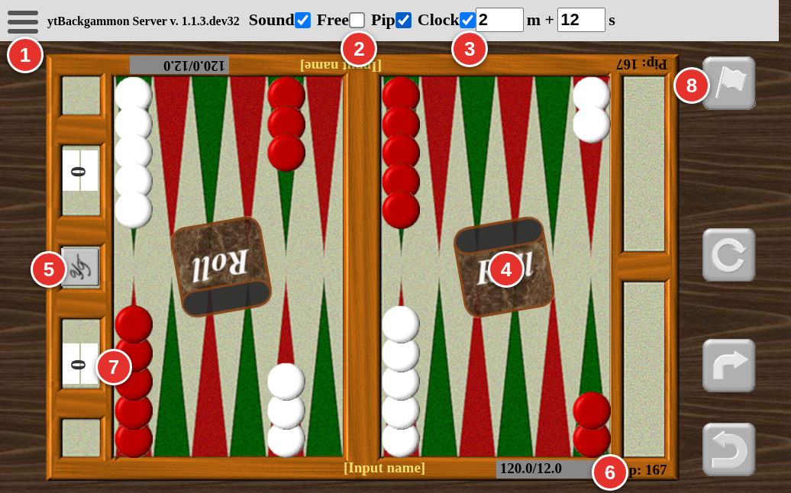
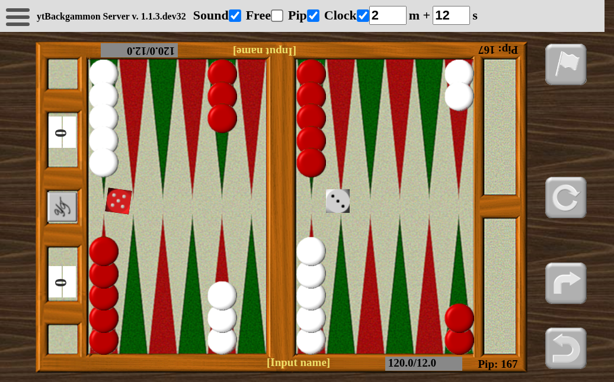
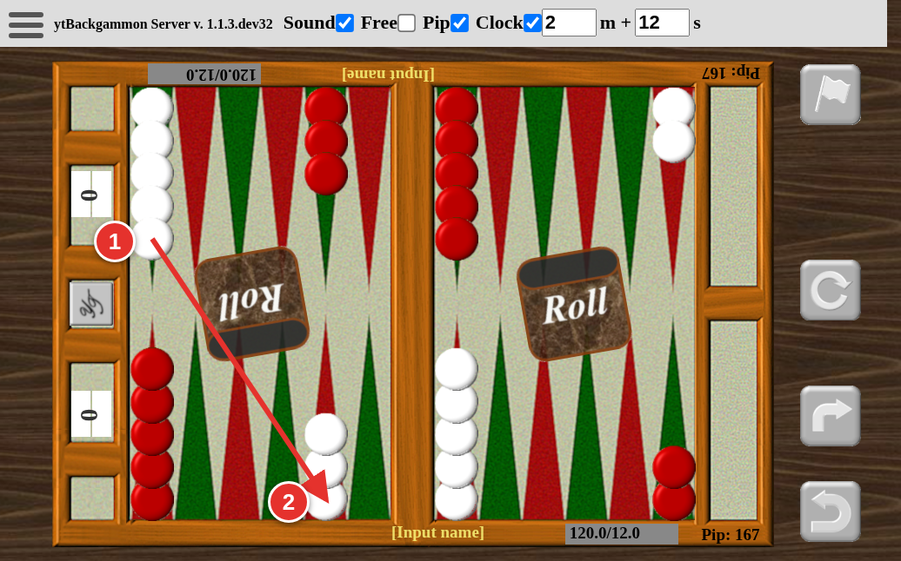
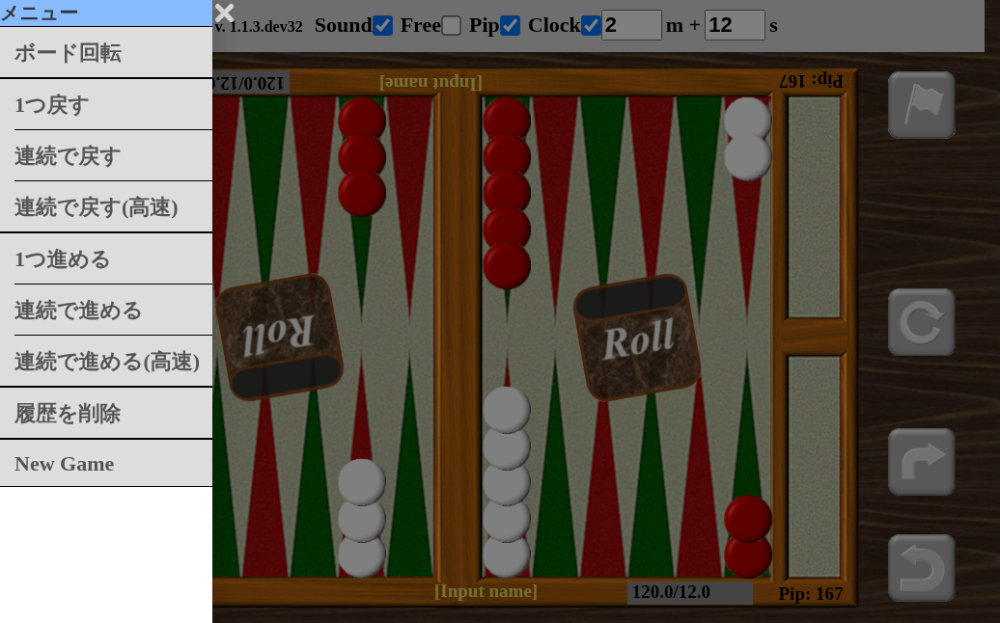

# 遊び方

ブラウザでボードを触る人向けの説明。
サーバの立て方は [Admin.md](Admin.md) にある。

## このボードの考え方

**1 枚のボードを、開いている人全員で共有する。**

- 対戦相手を組ませる仕組みは無い。**誰でも、どちらの側の駒でも動かせる**
- 見ているだけの人も動かせる。ダイスも振れる
- **誰かが操作すると、全員の画面がすぐ変わる**
- ルールのチェックは補助。合っていない手は置けないが、Free を入れれば
  どこへでも置ける

実際のボードを囲んでいるのに近い。ビデオ通話や音声通話をつないで、
話しながら遊ぶのがおすすめ。

## 画面を開く

ブラウザで `http://<ホスト>:<ポート>/` を開く。`/p1` と `/p2` も同じボード。

**リロードしても盤面は消えない。** 表示が崩れたときはリロードしてよい。
サーバが最新の盤面を送り直す。

## 画面の見方

| 番号 | 何か |
|------|------|
| 1 | メニュー |
| 2 | Free（ルールチェック） |
| 3 | Clock（持ち時間） |
| 4 | ダイスカップ |
| 5 | キューブ |
| 6 | PIP |
| 7 | スコア |
| 8 | 投了ボタン。その下に ボード回転・1 つ進める・1 つ戻す が縦に並ぶ |

使い方は、それぞれの節に書いてある。

### ヘッダ

| 番号 | 表示 | できること |
|------|------|------------|
| 1 | 三本線のアイコン | メニューを開く |
| 2 | Sound | 音のオン・オフ（**自分の画面だけ**） |
| 3 | Free | ルールチェックを外す（**全員に効く**） |
| 4 | Pip | PIP（残りの進む数）の表示 |
| 5 | Clock | 持ち時間のオン・オフ |
| 6 | `m +` と `s` の数値 | 持ち時間（分）と 1 手ごとの猶予（秒） |

### 名前とスコア

名前は入力欄に打つと全員に伝わる。スコアは横の ▲ ▼ で 1 点ずつ増減できる
（普通は自動で付くので、直したいときだけ使う）。

盤面には、場面に応じて**パス・勝ち・投了**のバナーが出る。

## ダイスを振る

**ダイスカップを押す。**

最初（オープニング）は、両方が 1 個ずつ振る。大きい目が出た側が先手で、
同じ目なら振り直し。

手番の人がカップを押すと 2 個振る。ゾロ目なら 4 回動かせる。

## チェッカーを動かす

**駒をつまんで、置きたいポイントへ運ぶ**（ドラッグ）。

1 の駒をつまんで 2 のポイントへ運ぶ。

- **その場で離すと、自動で動く**（ワンタッチムーブ）。動ける先が複数ある
  ときは、そのうちの 1 つへ動く
- 動かせない所へ置こうとすると、元の位置へ戻る
- 相手の駒が 1 枚だけのポイントへ入ると、**その駒はバーへ移る**（ヒット）
- バーに駒があるときは、まずそれを入れる
- すべて自陣に入ったら、外へ運び出せる（ベアオフ）

使ったダイスは、目が薄くなって使用済みになる。
**手が無いときは「パス」のバナーが出る。** 押すと手番が相手へ移る
（スペースキーでも操作できる）。

## ダブル（キューブ）

キューブを押すと、相手へダブルを掛ける。

- 相手が受ければ（テイク）、キューブの値が倍になって相手側へ移る
- 受けなければ（ドロップ）、掛ける前の値が掛けた側の得点になる

## 降参する

盤面の外の**投了ボタン**を押す。確認のバナーが出る。

- ダブルを掛けられて降りるときは、掛ける前の値が相手の得点
- ダブルが掛かっていないときに降りると、**バックギャモン扱い（3 倍）**

## 持ち時間（クロック）

ヘッダの **Clock** を入れると使える。**全員で 1 つの設定を共有する。**

- `m +` が持ち時間（分）、`s` が 1 手ごとに戻ってくる猶予（秒）
- 手番が移ると、相手の時計が動き出す
- 時計を押すと、止める・再開する
- 残り時間はマイナスにもなる（そこで止まったりはしない）

**サーバを止めている間の時間は数えない。** 立ち上げ直すと、時計は止まった
状態から始まる。

## 戻す・進める

**間違えても、いくらでも戻せる。** メニューか、盤面の外のボタンから。

| メニューの項目 | 動き |
|----------------|------|
| 1つ戻す / 1つ進める | 1 手ずつ |
| 連続で戻す / 連続で進める | ゆっくり自動で再生する |
| 連続で戻す(高速) / 連続で進める(高速) | 速く自動で再生する |

連続再生の途中で別の操作をすると、そこで止まって、**止まった時点の盤面が
そのまま残る。**

**戻しても時計は巻き戻らない。**

## New Game と「履歴を削除」

どちらもメニューから。**押すと全員の画面が変わるので、確認が出る。**

- **New Game** — 盤面を初期配置に戻す。スコアと名前は残る
- **履歴を削除** — それまでの手の記録を消す。**盤面はそのまま。**
  消すと戻せなくなる

## Free（ルールを無視する）

ヘッダの **Free** を入れると、**駒をどこへでも置ける。** ダイスの目も
押して変えられる。局面を並べて検討したいときや、教えるときに使う。

**この設定は全員に効く。** 終わったら外すこと。

## うまくいかないとき

**表示が崩れた** — リロードする。盤面はサーバが送り直す。

**反応が遅い、駒が飛ぶ** — 回線か端末の速さの問題。駒を離した瞬間は
自分の画面だけ先に動いていて、少し後にサーバの結果に合わせて直る。

**盤面が勝手に変わった** — **共有ボードなので、他の人の操作がそのまま届く。**
故障ではない。
